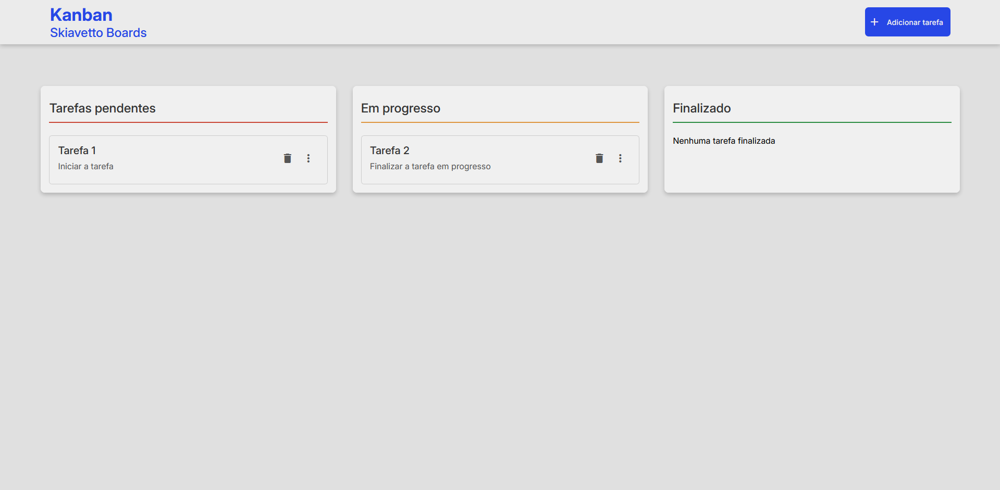
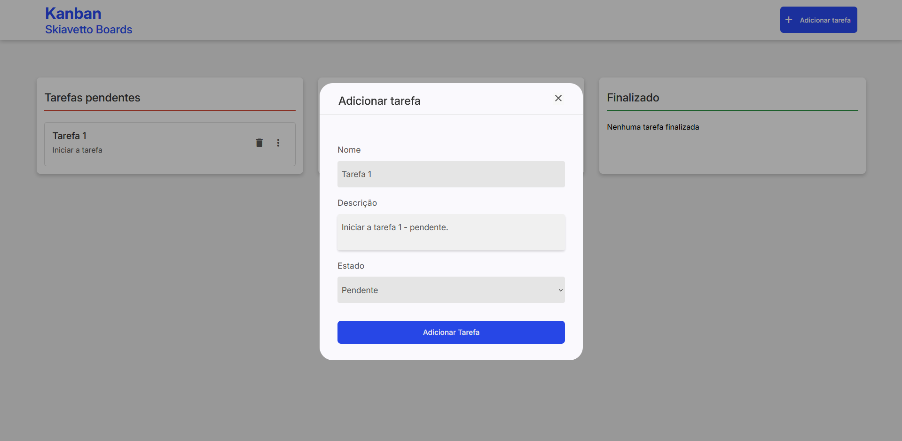

# Kanban

Este projeto Kanban desenvolvido em **Angular** permite gerenciar tarefas em três quadros principais: **Tarefas pendentes**, **Em Progresso** e **Finalizadas** 

## Funcionalidades

-  Adicionar tarefas em uma coluna com título e descrição 
-  Mover tarefas dinamicamente entre as colunas
-  Persistência de dados via `json-server` (simulação de back-end com API REST)
-  Interface clean e responsiva com Angular e Angular Material Design

## Tecnologias Utilizadas

- [Angular 17+](https://angular.io/) (Framework principal)
- [TypeScript](https://www.typescriptlang.org/) (Linguagem principal)
- [json-server](https://github.com/typicode/json-server) (Simulação de backend)
- [RxJS](https://rxjs.dev/) (Reatividade)
- [Angular Material](https://material.angular.io/) (Componentes de UI modernos e responsivos)


## Imagens do projeto

### Tela inicial


### Adicionando nova tarefa 


### Movendo tarefa para outro quadro


## Como rodar o projeto localmente
Siga os passos abaixo para executar o projeto em sua máquina local:

### 1. Clone o repositório

```bash
git clone https://github.com/skiavetto/kanban
cd kanban
```

### 2. Instale as dependências

```
npm install
```

### 3. Inicie o servidor simulado com json-server

```
npm install -g json-server
```
Em seguida execute:
```
json-server --watch db.json --port 3000
```
O servidor estará disponível em [http://localhost:3000](http://localhost:3000)

### 4. Iniciar a aplicação no Angular 
Em outro terminal execute: 
```
ng serve
```
Abra seu navegador e acesse: [http://localhost:4200](http://localhost:4200)
